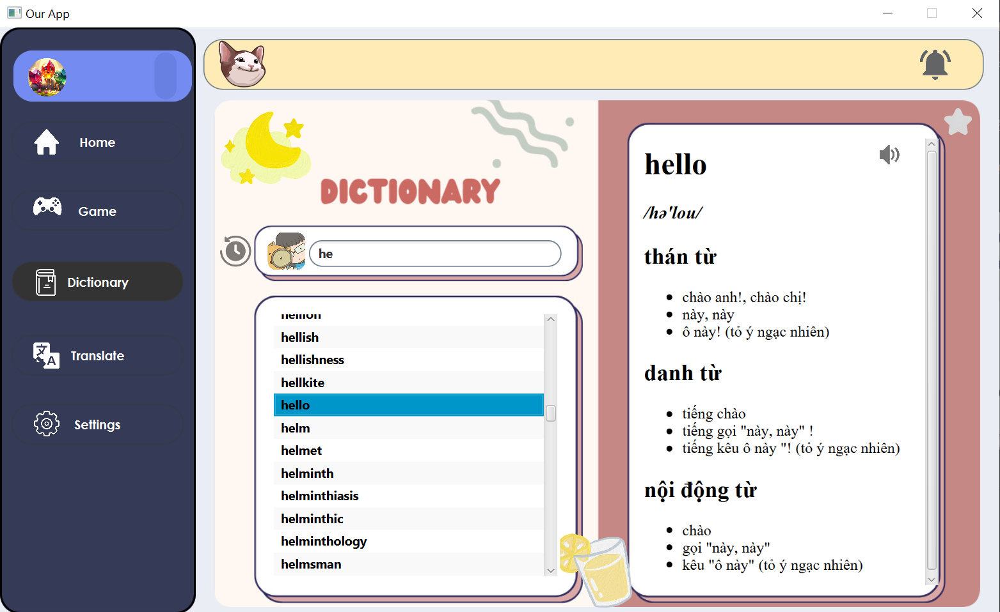

# ENGLISHNOVA (Dictionary App)

#### Table of contents
1. [Tác giả](#author)
2. [Giới thiệu](#introduction)
3. [Tính năng nổi bật](#features)
4. [UML Diagram](#uml)
5. [Phát triển tương lai](#future)

# Tác giả 

Group BACUCDA
- Lê Hoàng Vũ 22021176
- Vi Văn Quân 22021149
- Nguyễn Thế Khôi 23020388

# Giới thiệu 

* Ứng dụng từ điển giúp cho người dùng có thể tra cứu, học từ vựng tiếng Anh một cách nhanh và hiệu quả nhất.
* Ứng dụng được viết bằng ngôn ngữ Java và sử dụng thư viện JavaFX để hỗ trợ tạo giao diện đồ hoạ.
* Ứng dụng còn tích hợp 2 game để người dùng nâng cao được vốn từ, kiến thức cũng như học tiếng anh hiệu quả.
* Dưới cùng của thông tin từ sẽ có nghĩa khác của từ (nếu có).

# Tính năng nổi bật 

* Tìm từ, mỗi khi gõ kí tự vào ô tìm kiếm, ứng dụng sẽ tự động đề xuất những từ bắt đầu bằng những kí tự đã nhập vào.
* Với mỗi từ sẽ có phần giải nghĩa hiển thị ở bên phải của khu vực tìm kiếm.
* Ứng dụng cung cấp chức năng lưu từ vựng để người dùng có thể lưu lại những từ vựng cần thiết cho nhu cầu sử dụng.
* Với mỗi lần tra từ, ứng dụng sẽ tự động lưu lại lịch sử tra từ của người dùng theo thời gian gần nhất.
* Ứng dụng có chức năng thêm, xoá từ vựng. Những thay đổi này sẽ được cập nhật vào dữ liệu từ điển của ứng dụng.
* Một tính năng nữa của ứng dụng đó là phát âm từ vựng
* Trong quá trình sử dụng, những thay đổi của người dùng liên quan tới phần cài đặt sẽ được lưu lại cho lần sử dụng sau.
* Người sử dụng có thể tra cứu từ vựng trực tiếp từ dữ liệu của ứng dụng hoặc có thể sử dụng Google API để dịch từ hoặc câu như ứng dụng Google Translate.
* LearnLingo còn sử dụng API của Voicerss để phát âm 1 từ tiếng anh: https://www.voicerss.org/

# UML Diagram 

# Phát triển tương lai 

1. Thêm nhiều từ điển hơn trong app.
2. Tích hợp nhiều game phức tạp.
3. Phát triển thêm tiện ích người dùng.
